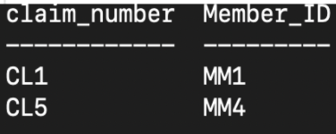
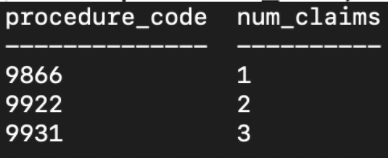
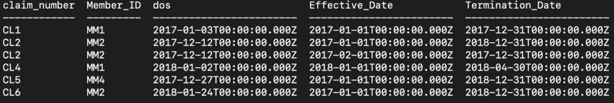
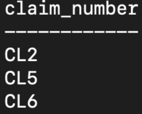
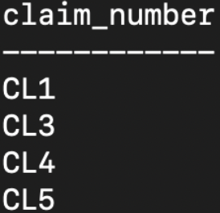
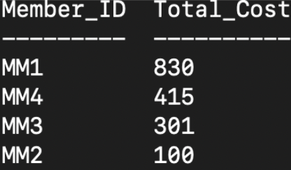

# Setting Up SQL Server in Docker for SQL practice

## Background
I am creating a sql db from which I can freely query and do analyses. For this project, I will be practicing with health care data.


## Getting Started

1. Run `% docker-compose up` to build container. This will set up your data base using image from Dockerfile (which in this case uses data volume already backed up)  
2. `% mssql -u sa -p reallyStrongPwd123` to enter mssql interactive mode/cli. You will be able to create tables and make queries. Please be sure to backup and save as new image should you make a fundamentally different image you need in future.
3. `% docker exec -it [container id] /bin/bash/` allows for interactive mode, allowing for bash to hijack shell


## Some useful commands
- `% docker images` to view all images; please note that this will show your current directory and service (e.g. interview_mssql) as its own image in addition to the image you are working out of `casestudy-datasetup`. Please do not touch either of these.  
- `% docker container ls` to view all containers  
- `% docker container prune -f` to remove all stopped containers


## Components
- Dockerfile: creates image that is recipe for the database  
- docker-compose.yml: Builds the image; Note that local ports that can run mssql are 1434, 1433, 1431  

** Please note that to get image casestudy-datasetup, I ran `% Docker commit image [image id]` in order to backup the database data.**  

Below are commands I ran in mssql cli to set up database and tables prior to committing image. Please note to be careful when committing image. Need to make sure processes are idle before copying, otherwise if something is half written, then the copy of that data will be corrupted.


```
CREATE TABLE Claims(claim_number NVARCHAR(10), dos DATE, procedure_code INT, Member_ID NVARCHAR(10))
INSERT INTO Claims VALUES ('CL1','2017-01-03',9931,'MM1')
INSERT INTO Claims VALUES ('CL2','2017-12-12',9922,'MM2')
INSERT INTO Claims VALUES ('CL3','2017-11-13',9866,'MM3')
INSERT INTO Claims VALUES ('CL4','2018-01-02',9931,'MM1')
INSERT INTO Claims VALUES ('CL5','2017-12-27',9931,'MM4')
INSERT INTO Claims VALUES ('CL6','2018-01-24',9922,'MM2')

CREATE TABLE Procedures(Procedure_Code INT, Effective_Date DATE, Cost DECIMAL(13,2), Type NVARCHAR(50))
INSERT INTO Procedures VALUES(9866,'2017-01-01', 150.00, 'Lab Test')
INSERT INTO Procedures VALUES(9866,'2018-01-01', 151.00, 'Lab Test')
INSERT INTO Procedures VALUES(9887,'2017-01-01', 275.00, 'Minor Surgery')
INSERT INTO Procedures VALUES(9887,'2018-01-01', 275.00, 'Minor Surgery')
INSERT INTO Procedures VALUES(9921,'2017-01-01', 50.00, 'Evaluation')
INSERT INTO Procedures VALUES(9922,'2017-01-01', 50.00, 'Evaluation')
INSERT INTO Procedures VALUES(9931,'2017-01-01', 200.00, 'Minor Surgery')
INSERT INTO Procedures VALUES(9931,'2018-01-01', 215.00, 'Minor Surgery')

CREATE TABLE Members(Member_ID NVARCHAR(10),Policy NVARCHAR(50),Effective_Date DATE, Termination_Date DATE)
INSERT INTO Members VALUES('MM1','Gold','2017-01-01','2017-12-31')
INSERT INTO Members VALUES('MM2','Silver','2017-02-01','2017-12-31')
INSERT INTO Members VALUES('MM3','Gold','2017-04-01','2017-10-31')
INSERT INTO Members VALUES('MM4','Platinum','2017-01-01','2018-12-31')
INSERT INTO Members VALUES('MM1','Silver','2018-01-01','2018-04-30')
INSERT INTO Members VALUES('MM2','Silver','2017-01-01','2018-12-31')
INSERT INTO Members VALUES('MM3','Bronze','2018-01-01','2018-12-31')

```

## Data Persistance
Please note all data used in creation of casestudy-datasetup image automatically saved via `-v <host directory>/data:/var/opt/mssql/data`. Host directory `/var/opt/mssql/data` is mounted as data volume in container and can be used as backup.


## Questions I Examined
1. Return all claims and members who filed Minor Surgery claims with dates of service in 2017.  
  

2. What are the number of claims that we received per procedure code? 
  

3. How would you determine whether all of the claims in table claims should be covered?  
If we are to just look at only claims covered within policy effective dates:  
  
  

If we are to assume that certain plans cover certain types of claims:  
  

4. Which claims have a cost that is greater than $150.00?   
  

5. Who is the least expensive member? What is their total cost of their claims?  
Let's take a look at all members and their respective total cost:  
  

We can see that one member is less expensive. We also want to note any members that have the same total cost as well.  
   

6. What could we change about the procedures table to make it less risky for future analysis?  

- Should instead use a unique id/primary key as opposed to using composite of procedure code and effective date. There is a chance future analyses might accidentally forget to use effective date columns in combination with procedure code column (e.g. selecting Cost or Type based on specific procedure code return results using wrong effective date. When we use member id in Claims table to get the procedure type, we might not get the right type).  
- As the data stored in database expands, might be a good idea to also have a column for currency. Cost may expand across multiple regions in the globe.  
- Column names should be a bit more descriptive. In the case of the procedures table, it is hard to see what 'effective date' is referring to.  